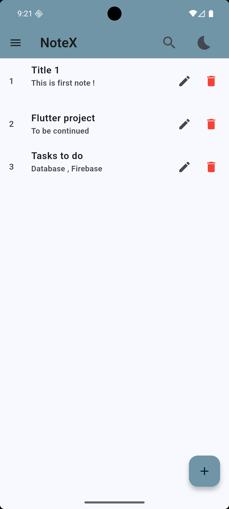
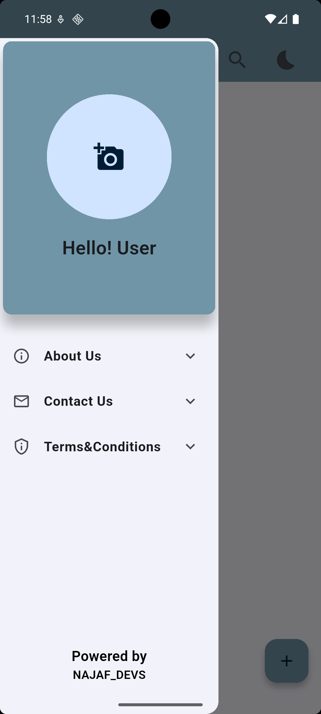
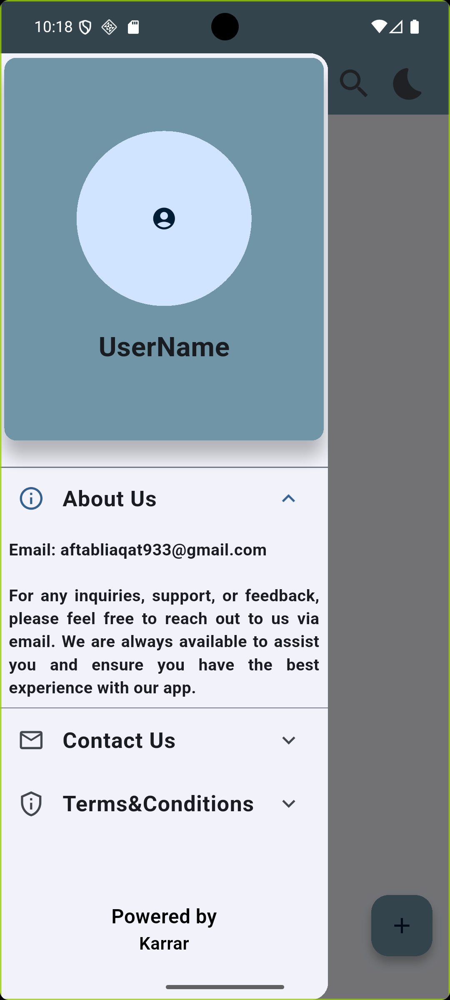
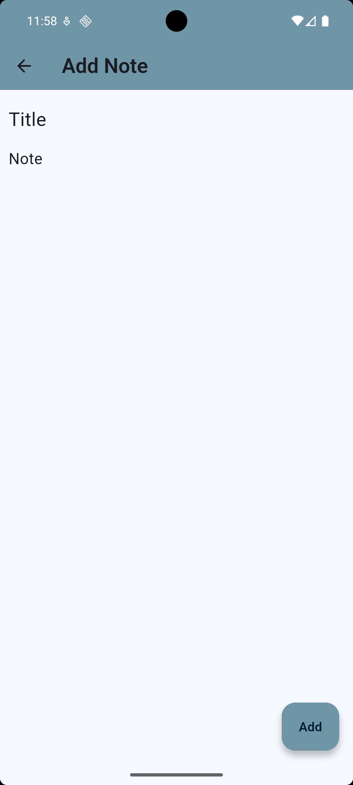

# 📒 NoteX - Flutter Notes App

**NoteX** is a beautifully designed, lightweight, and powerful note-taking Flutter app. Built with clean architecture, smooth UI transitions, local SQLite storage, and cool features like custom themes, note search, update, and delete!

---

## ✨ Features

- 📝 Create, read, update, delete notes (CRUD)
- 🔍 Real-time search functionality
- 🎨 Theme customization (light/dark)
- 💾 Local data persistence using SQLite
- 💥 Smooth animations and transitions
- 📂 Clean and maintainable folder structure

---

## 📱 Screenshots

<div align="center">





<br><br>





</div>

---

## 🛠️ Tech Stack

- **Flutter**
- **Dart**
- **SQLite (sqflite package)**
- **Provider** (for state management)
- **SharedPreferences** (for theme & image persistence)

---

## 🚀 Getting Started

```bash
git clone https://github.com/your-username/notex.git
cd notex
flutter pub get
flutter run
